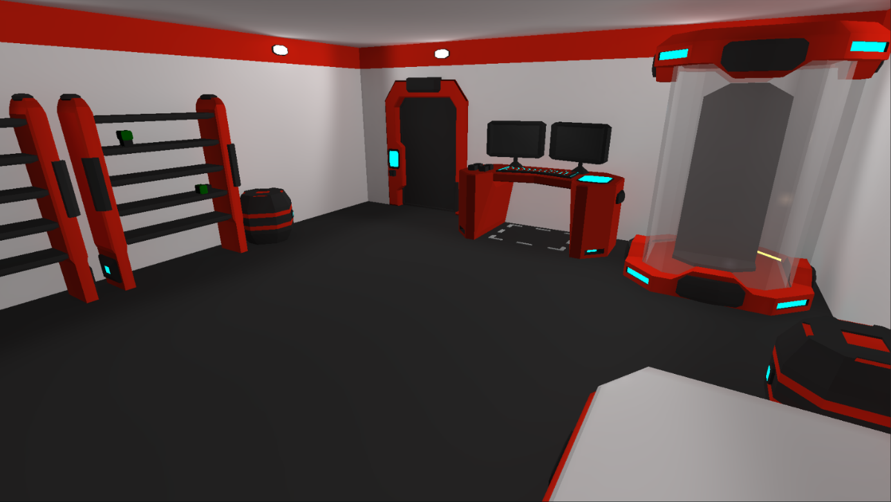
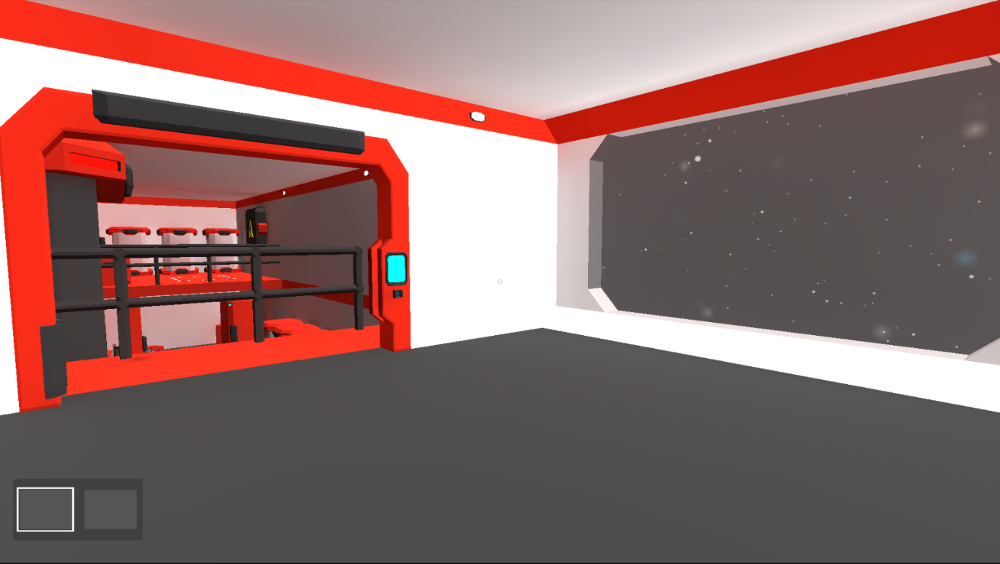

# SpaceEscape

This game was created as a part of my engineer's thesis for Politechnika Częstochowska.

# Description

The game is a 3D puzzle solver in low-poly style revoled around controlling your surroundings via computer console. 

The goal of this project was to create an interesting environment that could bring the aspect of programming/using console closer to people that had never used it. Additionaly game attempts to teach player how logic gates look and work. 
The puzzles are progresively getting more and more difficult to test your logical thinking and knowledge gained while playing.

# Current state of the game:
- Two fully playable levels showcasing game's potencial
- Autosave is currently the only option to save your progress
- Simple level loading system

# Game mechanics:
- Player has to find a matching usb pair (matching colors)
- All programmable devices have a usb port
- Devices behaviours can be altered via commands on connected computer
- All devices have to be powered in order to be used (indicated by blue or red colors)
- In order to restore power player has to solve a "wirebox" puzzle which contains logic gates
- Levels design with gravity manipulation in mind - entrences on the walls or in the ceiling

# Current devices:
- Graviton (can change player's gravity depending on prior console command)
- Doors
- Elevators

# Preview

### __Enviorment__

---

### __Console__

---

### __Graviton device__

---

### __WireBox__

---
